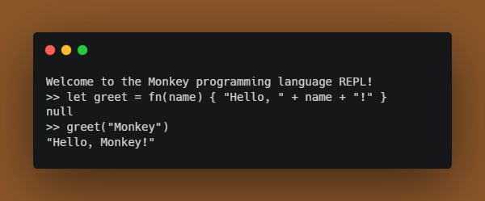
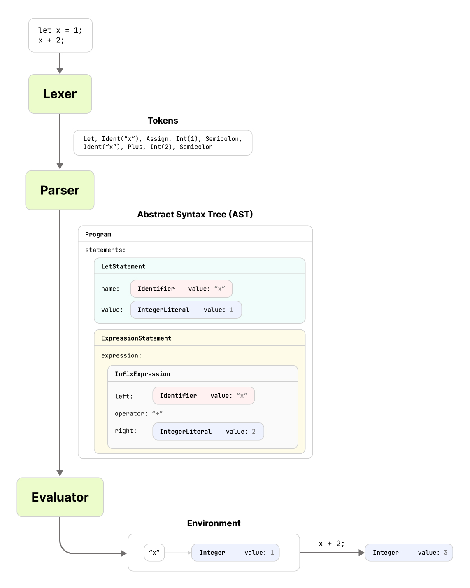

# monkey-language-ts

Yet another TypeScript implementation of the [Monkey language](https://monkeylang.org/), based on the book [Writing An Interpreter In Go](https://interpreterbook.com/).



## How to Run?

Prerequisites:

- NodeJS >=18.3.0
- Install [pnpm package manager](https://pnpm.io/installation)

Steps:

1. Clone the repository
2. Install dependencies

   ```bash
   pnpm install
   ```

3. Build the project

   ```bash
   pnpm build
   ```

4. Run the CLI

   ```bash
   # REPL Mode
   node ./lib/cli/index.js

   # Run a Monkey script (*.monkey)
   node ./lib/cli/index.js ./examples/1-hello-world.monkey
   ```

## Comparison with Prior Art

This project aims to differentiate itself from many existing implementations (see [Related Work](#related-work)):

- Uses idiomatic TypeScript instead of a direct 1:1 translation from the official Go implementation, for example:
  - Uses TypeScript naming conventions
  - Uses [JavaScript `Error` object](https://developer.mozilla.org/en-US/docs/Web/JavaScript/Reference/Global_Objects/Error) to represent parsing or evaluation errors
- The Abstract Syntax Tree (AST) types are inspired by [Babel's AST](https://github.com/babel/babel/blob/main/packages/babel-types/src/ast-types/generated/index.ts).
- Plenty of JSDoc and comments to make the codebase easier to read.

## Example Programs

Example programs and their descriptions can be found under the [`examples` directory](./examples/).

## Big Picture

The interpreter has 3 main components:

1. **Lexer**: Converts the source code into tokens.
2. **Parser**: Converts the tokens into an Abstract Syntax Tree (AST) that represents the program.
3. **Evaluator**: Walks the AST and executes the program.



## Related Work

Other TypeScript implementations:

- [CDThomas/ts-monkey](https://github.com/CDThomas/ts-monkey) - Highly inspired by this project, also with in-browser editor
- [MichaelB-99/ts-monkey](https://github.com/MichaelB-99/ts-monkey) - With language extensions, bytecode compiler, and virtual machine
- [MarioAriasC/TSMonkey](https://github.com/MarioAriasC/TSMonkey) - TypeScript implementation running on [Bun](https://bun.sh/)

Other implementations:

- [Monkey](https://monkeylang.org/) - Official Monkey language website. Contains links to various implementations.
- [ThePrimeagen/ts-rust-zig-deez](https://github.com/ThePrimeagen/ts-rust-zig-deez) - Monkey lexer implementation in various languages.

## Future Work

If you're looking to extend the Monkey language, you can consider:

- UTF-8 character support
- Allow variable reassignment
- Code comments (e.g. `//` or `/* */`)
- More loops (e.g. `while`, `for`)
- More built-in functions
- Type system and type annotations
- Better error reporting (e.g. line and column numbers, better error message)

## Special Thanks

- [Thorsten Ball](https://thorstenball.com/) for writing the book [Writing An Interpreter In Go](https://interpreterbook.com/).
- [create-typescript-app](https://github.com/JoshuaKGoldberg/create-typescript-app) for the project template.
